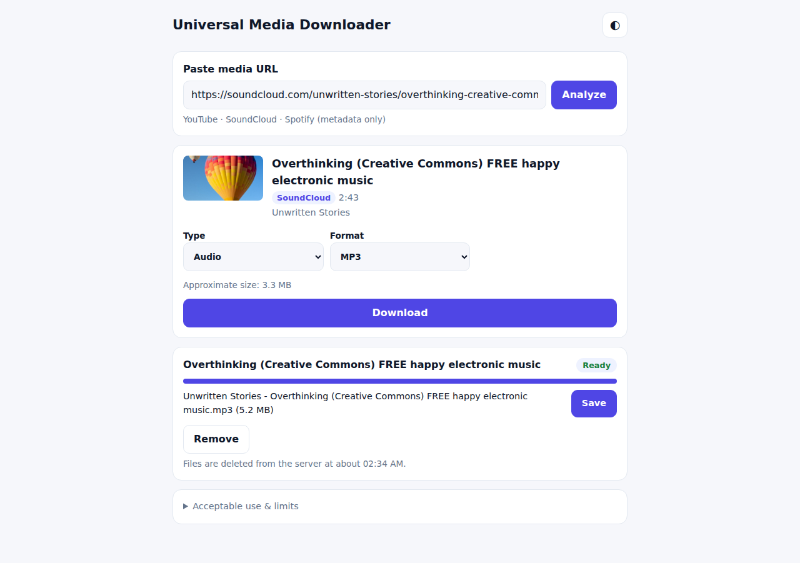
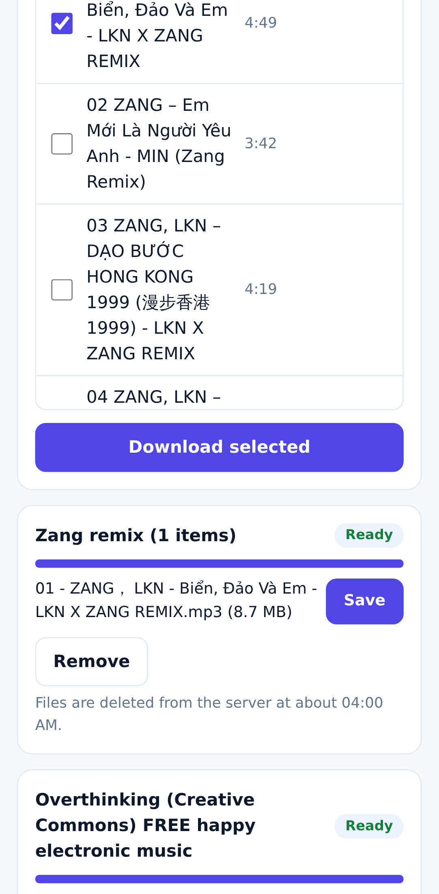

# Universal Media Downloader

A small, free-tier web app for downloading media you are allowed to download — your own uploads,
public-domain or Creative Commons works — from YouTube and SoundCloud. Spotify links are supported
as a **metadata resolver only**: the app reads track names and helps you find a matching public upload
elsewhere. It never downloads audio from Spotify.

Open the website, paste a URL, pick a format, download. No account, no install, no terminal.

- **Website:** https://hadezkz002.github.io/universal-media-downloader/
- **API:** https://umd-api-7bx5.onrender.com/api/health (Render free instance)

| Desktop | Android |
|---|---|
|  |  |

## Supported platforms

| Source | Status | Notes |
|---|---|---|
| SoundCloud track | **SUPPORTED** | Public tracks via `soundcloud.com`, `m.soundcloud.com` or `on.soundcloud.com` share links. MP3 / M4A / Opus / FLAC / original. |
| SoundCloud set / playlist | **SUPPORTED** | Share links resolved automatically. Every item listed with title, artist, duration and artwork; Go+ / region-blocked items are shown as unavailable and skipped instead of failing the playlist. Numbered files, ZIP. |
| YouTube video / Shorts | **PARTIAL** | Works locally and from residential IPs. From the cloud server YouTube often answers *"Sign in to confirm you're not a bot"*; this service does not use cookies, accounts or bot-check workarounds, so such videos fail with a clear message. |
| YouTube playlist / channel | **PARTIAL** | Listing works; downloading each item is subject to the same bot check. Channel URLs use the *Videos* tab. |
| Spotify track / album / playlist | **PARTIAL (metadata only)** | Title, artists, artwork and track list from Spotify's public embed. "Find source" searches SoundCloud and YouTube; you confirm a candidate and the file comes **from that source**, labelled as such. |
| Spotify audio | **UNSUPPORTED** | DRM-protected. Never downloaded, never decrypted. |
| Private, members-only, age-restricted, geo-blocked, paywalled, DRM content | **UNSUPPORTED** | Rejected with an explanation. No bypass of any kind. |
| Live streams | **UNSUPPORTED** | |
| Any other site | **UNSUPPORTED** | Strict host allowlist (anti-SSRF). |

## Formats

| Type | Options |
|---|---|
| Audio | MP3, M4A, Opus, Original (no re-encode), FLAC* |
| Video (YouTube) | Best available, MP4 1080p / 720p / 480p / 360p, WebM |

\* FLAC only stores the lossy source in a lossless container. It does **not** improve quality.

Separate video/audio streams are merged with FFmpeg. Audio files get title, artist, album
(playlist name), track number and cover art when the source provides them.

File names:

```
single audio     Artist - Title.ext
video            Title [video-id].ext
playlist         01 - Artist - Title.ext
```

Unicode (Vietnamese, Chinese, Japanese, emoji) is kept; path separators and characters invalid on
Windows/Android are replaced; names are capped at 180 UTF-8 bytes.

## Architecture

```
Browser ──► GitHub Pages (static HTML/CSS/JS, no build step)
   │
   │ HTTPS JSON + polling
   ▼
Render free web service (Docker)
  FastAPI ── URL validator (host allowlist + public-IP check)
          ── rate limiter (per IP, in memory)
          ── job manager (thread pool, bounded queue, TTL cleanup)
          ── yt-dlp subprocess (+ FFmpeg, Deno JS runtime)
          ── Spotify embed metadata reader
          ── /tmp work dir (ephemeral)
```

Why this stack (checked October 2026):

- **GitHub Pages** – free static hosting for public repos.
- **Render free web service** – runs Docker images with outbound network and a writable temp FS;
  750 instance-hours/month, sleeps after 15 min idle (~1 min cold start), no persistent disk.
- Rejected after checking their current docs/pricing: Hugging Face Docker Spaces (now need a paid plan to
  create), Koyeb (free tier is Postgres only). Not chosen without deeper evaluation: Fly.io, Railway,
  Cloud Run (usage-based / trial plans with billing). GitHub Actions is not a web server.
- One process, in-memory queue: no Redis, database or message broker is needed at this scale.

Input handling: the page extracts the first http(s) URL from pasted text (quotes and trailing punctuation
removed, query strings such as YouTube `list=` kept), shows a platform/type guess immediately and analyzes
automatically after a 400 ms pause (previous requests are aborted). The server repeats the normalization
and is the final authority.

Share links (`on.soundcloud.com`) are resolved on the server before detection: HEAD requests hop by hop
(max 5 hops, 10 s timeout), each connection pinned to an IP that was checked to be public (no second DNS
lookup, so no DNS rebinding), and every `Location` re-validated against the host allowlist. Share-tracking
parameters are dropped. yt-dlp then receives the canonical URL.

Job lifecycle: `queued → downloading → processing / merging → zipping → ready | failed`.
The browser polls `GET /api/jobs/{id}` every 1.5 s.

### API

| Method | Path | Purpose |
|---|---|---|
| GET | `/api/health` | Status, tool versions, public limits |
| POST | `/api/analyze` `{url}` | `platform`, `media_type` (video / shorts / track / playlist / album / channel / profile), `original_url`, `resolved_url`, metadata, formats, sizes, `item_count`, `available_count`, `unavailable_count`, items |
| POST | `/api/resolve` `{title, artist}` | Spotify resolver: candidate public sources |
| POST | `/api/jobs` `{url, mode, format, quality, items?, playlist_title?}` | Start a job |
| GET | `/api/jobs/{id}` | Status, progress, `counts` (ready / failed / skipped) |
| GET | `/api/jobs/{id}/files/{index}` | Download one file |
| GET | `/api/jobs/{id}/zip` | Download all ready files as ZIP |
| DELETE | `/api/jobs/{id}` | Cancel and delete files |

Job IDs are 128-bit random tokens; knowing the ID is what grants access to a job's files.

## Security

- Only `http`/`https`; no credentials in URLs; no custom ports; max URL length 2048.
- **Exact host allowlist** (YouTube, SoundCloud, open.spotify.com; `api-v2.soundcloud.com` only for `/tracks/<id>`). DNS is resolved and every address
  must be public: loopback (127.0.0.0/8, ::1), RFC1918, CGNAT, link-local (incl. 169.254.169.254
  metadata), ULA (fc00::/7), multicast and IPv4-mapped variants are rejected.
- yt-dlp runs with `--ignore-config` and `--use-extractors` limited to YouTube/SoundCloud extractors,
  so the generic extractor (arbitrary URL fetching) can never run.
- yt-dlp runs as a subprocess with an argument list (no shell). Clients choose only from enumerated
  modes/formats/qualities; they cannot pass yt-dlp options. URLs are passed after `--`.
- Files are addressed by job ID + index from the server's own records; client input never forms a path.
- Filenames sanitized; ZIP entry names sanitized and de-duplicated.
- Limits: request body size, per-IP request and job rate limits, per-IP active jobs, global queue size,
  concurrency, job timeout (process group killed, including FFmpeg), max file size, max duration,
  max playlist items, no live streams.
- Media is temporary: deleted after `FILE_TTL`, on `DELETE`, and wiped on every restart.
- No cookies, no accounts, no PO tokens, no proxy rotation. Errors shown to users are mapped to plain
  messages; tracebacks only go to server logs.
- CORS restricted to the Pages origin in production. The container runs as a non-root user.
- **No secrets are required.** None are stored in this repository.

## Resource limits (production defaults, `render.yaml`)

| Variable | Default | Meaning |
|---|---|---|
| `MAX_DOWNLOAD_SIZE_MB` | 150 | Per file (`--max-filesize`) |
| `MAX_PLAYLIST_ITEMS` | 25 | Items per job |
| `MAX_ANALYZE_ITEMS` | 500 | Items listed when analyzing a playlist |
| `MAX_VIDEO_DURATION` | 1800 | Seconds per item |
| `MAX_CONCURRENT_JOBS` | 1 | Jobs processed at the same time (items inside a job are sequential) |
| `MAX_QUEUED_JOBS` | 8 | Active + queued jobs before "Server is busy" |
| `MAX_ACTIVE_JOBS_PER_IP` | 2 | |
| `JOB_TIMEOUT` | 900 | Seconds per job |
| `ANALYZE_TIMEOUT` | 60 | Seconds per analyze call |
| `FILE_TTL` | 1800 | Seconds files are kept after a job finishes |
| `RATE_LIMIT_PER_MINUTE` | 20 | Analyze/resolve requests per IP |
| `JOB_RATE_LIMIT_PER_HOUR` | 15 | Jobs per IP |
| `MAX_REQUEST_BYTES` | 32768 | Request body limit |
| `ALLOWED_ORIGINS` | `*` (dev) | Comma-separated CORS origins |
| `CLIENT_IP_HEADER` | empty | Header with the real client IP behind a trusted proxy (`true-client-ip` on Render) |
| `YTDLP_JS_RUNTIMES` | `deno` | JS runtime(s) for YouTube (`node` works locally) |
| `WORK_DIR` | `/tmp/umd-work` | Temporary files |

## Local development

Requirements: Python 3.12+, FFmpeg, and Deno or Node.js.

```bash
cd backend
python -m venv .venv && . .venv/bin/activate
pip install -r requirements-dev.txt
YTDLP_JS_RUNTIMES=node uvicorn app.main:app --port 8765    # API on http://localhost:8765

# second terminal: frontend (config.js already points to localhost:8765)
cd frontend && python -m http.server 8080                  # open http://localhost:8080
```

Tests:

```bash
cd backend && ruff check . && pytest -q        # unit + API tests (no network)
python tests/ui_smoke.py http://localhost:8080/   # browser test, needs: pip install playwright
```

Docker:

```bash
docker build -t umd-api backend
docker run --rm -p 8000:8000 -e ALLOWED_ORIGINS='*' umd-api
```

## Deployment

**Backend (Render, free):**

1. Sign in at https://dashboard.render.com (GitHub login works). Render may ask for account verification.
2. *New → Blueprint*, choose this repository. Render reads `render.yaml` and builds `backend/Dockerfile`.
3. Copy the service URL, e.g. `https://umd-api.onrender.com`.

**Frontend (GitHub Pages):**

1. Repository *Settings → Pages → Source: GitHub Actions*.
2. *Settings → Secrets and variables → Actions → Variables*: `API_BASE_URL` = the Render URL.
3. Push to `main` or run the *Deploy frontend* workflow. *Production smoke test* runs afterwards.

If you deploy under another domain, update `ALLOWED_ORIGINS` on Render.

## CI

- `CI`: ruff, pytest, `pip-audit`, JS syntax check, frontend build, Docker build + container health check.
- `Deploy frontend`: builds `_site` with `config.js` from `vars.API_BASE_URL` and deploys to Pages.
- `Production smoke test`: wakes the API, then runs the Playwright test (desktop + Pixel 7 viewport)
  against the live site and uploads screenshots.

## Troubleshooting

| Symptom | Cause / fix |
|---|---|
| First request takes ~1 minute | Free instance was asleep. The page shows "Waking up the free server". |
| "YouTube blocked this server with a bot check" | YouTube distrusts datacenter IPs. Not worked around by design. Try later or use the self-hosted setup from a home connection. |
| "Server is temporarily busy" | Queue full (`MAX_QUEUED_JOBS`). Retry later. |
| "Too many requests" | Per-IP rate limit. Wait a minute. |
| "Job not found or expired" | Files are removed after `FILE_TTL` or after a server restart/sleep. Run the job again. |
| CORS error in the browser console | `ALLOWED_ORIGINS` does not include the site origin. |
| Formats missing on YouTube | Update yt-dlp (`requirements.txt`) and make sure a JS runtime is installed. |

## Known limitations

- YouTube from the free cloud server is unreliable. Observed on 2026-10-01: the Render instance got
  HTTP 429 / bot-check responses from YouTube while the same requests worked from a residential IP.
- A sleeping free instance loses all jobs and files; in-progress jobs are lost on restart.
- Single instance, in-memory state: not horizontally scalable without adding shared storage.
- Free instance has little CPU: MP3/Opus conversion of long items is slow; MP4/M4A at source codec is fastest.
- Render free bandwidth is limited per month; heavy use will suspend the service until the next cycle.
- SoundCloud set item metadata relies on a small patch of yt-dlp internals (`backend/app/ytdlp_cli.py`); if a yt-dlp update breaks it, listings fall back to bare URLs but downloads keep working.
- SoundCloud Go+ / region availability depends on where the server runs (the Render region may differ from yours).
- Spotify metadata comes from the public embed page, which may change without notice.
- Spotify short links (`spotify.link`) are not accepted; use the `open.spotify.com` URL.

## Legal / acceptable use

This tool is for content you own, have permission to download, or that is in the public domain or under
a licence that allows it (e.g. Creative Commons). You are responsible for complying with copyright law and
each platform's terms of service. The service does not circumvent DRM, Widevine, paywalls, subscriptions,
logins, age gates, geo-blocks or any other access control, and it never stores media permanently.

Spotify is a trademark of Spotify AB; YouTube of Google LLC; SoundCloud of SoundCloud Global Limited.
This project is not affiliated with any of them.

## License

MIT — see [LICENSE](LICENSE).
